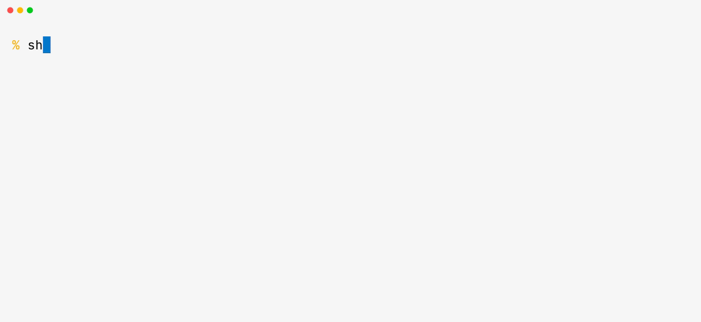

# ShellGenius

ShellGenius turns task descriptions into shell commands.



## Installation

Install with [`uv`](https://docs.astral.sh/uv/) (recommended):

```bash
uv tool install shellgenius
```

Or with `pip`:

```bash
python3 -m pip install shellgenius
```

## OpenAI API key

ShellGenius requires an OpenAI API key. Get one from [OpenAI's API key page](https://platform.openai.com/settings/organization/api-keys), then store it with:

```bash
shellgenius key set
```

This writes the key to `~/.config/lmt/key.env`. To edit it later:

```bash
shellgenius key edit
```

ShellGenius checks `OPENAI_API_KEY` first, then `~/.config/lmt/key.env`.

On Windows, `shellgenius key set` also works. If you prefer an environment variable:

```powershell
setx OPENAI_API_KEY your_key
```

## Usage

Describe what you want in plain English:

```bash
shellgenius "show the ten largest directories in this repo"
shellgenius "find every .log file changed in the last hour"
shellgenius "rename all .jpeg files in the current dir to .jpg"
```

In an interactive terminal, ShellGenius shows the response with formatting and asks before execution. In non-interactive output, it prints the generated command:

```bash
cmd=$(shellgenius "print the current git branch name")
printf '%s\n' "$cmd"
shellgenius --cmd "show all files changed since origin/main"
```

Use `--raw` for plain-text output and `--rich` to force Rich rendering in a terminal.

Use `--cmd` when you want only the executable command, even in a TTY.

## Options

| Flag | Effect |
|---|---|
| `-m`, `--model` | Model to use (default: `gpt-5.4-mini`). Run `shellgenius models` to list options. |
| `--no-stream` | Disable live Rich streaming. |
| `-r`, `--raw` | Print the full response as plain text. |
| `-R`, `--rich` | Force Rich formatting in a TTY; fall back to plain text otherwise. |
| `--cmd` | Print only the command, even in a TTY. |
| `--tokens` | Print prompt token count and estimated cost, then exit. |

## Shell Completion

Enable Click's generated completion for flags and explicit subcommand paths:

### Bash

```bash
eval "$(_SHELLGENIUS_COMPLETE=bash_source shellgenius)"
```

### Zsh

```bash
eval "$(_SHELLGENIUS_COMPLETE=zsh_source shellgenius)"
```

### Checked-in scripts

Checked-in completion scripts are also available in `completion/_complete_shellgenius.bash` and `completion/_complete_shellgenius.zsh`.

## Model Selection

List supported models and their short aliases:

```bash
shellgenius models
```

Use an alias with `-m`:

```bash
shellgenius -m 4.1 "list the ten largest files"
shellgenius -m 5.4-mini "find all TODO comments"
```

## Customizing Colors

ShellGenius reads color settings from `~/.config/lmt/config.json`. If the file is missing or unreadable, Rich's built-in defaults are used.

### Shared keys

These `lmterminal` compatibility keys apply across tools:

* `code_block_theme` — any [Pygments style](https://pygments.org/styles/) name, plus the built-in `alabaster` and `alabaster-shellgenius` themes.
* `inline_code_theme` — any Rich style string, such as `"#325cc0 on #f0f0f0"`.

### ShellGenius-only overrides

Add a `shellgenius` block to change ShellGenius without affecting other tools:

* `theme` — ShellGenius's own preset. Built-in values: `default`, `alabaster`, `alabaster-shellgenius`. Any Pygments theme name also works for fenced code blocks.
* `styles` — override individual Rich semantic styles (`markdown.h1`, `markdown.code`, `markdown.code_block`). `markdown.code` overrides the top-level `inline_code_theme` for ShellGenius only; `markdown.code_block` controls the command-block background in TTY output.

Example:

```json
{
  "code_block_theme": "alabaster",
  "inline_code_theme": "#325cc0 on #f0f0f0",
  "shellgenius": {
    "theme": "alabaster",
    "styles": {
      "markdown.code_block": "on #f0f0f0",
      "markdown.h1": "bold #325cc0"
    }
  }
}
```

Invalid `styles` entries are ignored individually, so one bad override does not discard the rest. The built-in `alabaster` preset keeps the upstream `#f8f8f8` syntax background; for a darker command block, add `{"markdown.code_block": "on #f0f0f0"}` under `styles`.

Legacy top-level `code_block_theme: "alabaster-shellgenius"` is still honored, but new config should prefer `shellgenius.theme`. These settings affect Rich output only; `--raw` and `--cmd` output is unchanged.

## License

ShellGenius is released under the [Apache 2.0 License](LICENSE).

<https://github.com/sderev/shellgenius>
